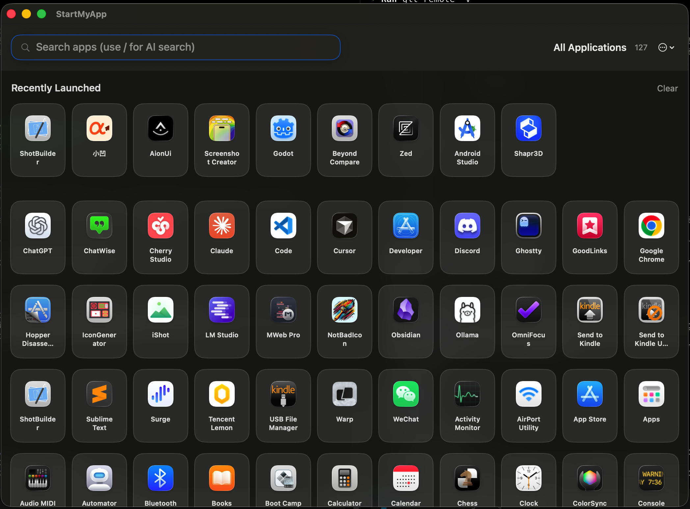

# LaunchDeck

Repository: <https://github.com/everettjf/startmyapp>

Formerly StartMyApp.

[https://startmy.app](https://startmy.app)

[](https://discord.gg/eGzEaP6TzR)

A modern macOS app launcher focused on fast discovery, organization, and launch.

## Screenshot



## Highlights

- Auto-discover system and user apps and keep layout in sync
- Custom grid layout: drag to reorder, drag to create folders, favorite apps
- Search-first: keyword filtering + optional AI semantic search (type `/`)
- Recently launched and most-launched sorting, with hidden apps support
- Menu bar entry + global hotkey to summon instantly

## Requirements

- macOS 26.0+
- Xcode 26.0+ and XcodeGen (local build)
- AI semantic search requires Apple Intelligence-capable hardware, enabled in System Settings, and the model available

## Build Locally

1. Install XcodeGen: `brew install xcodegen`
2. Generate the project: `xcodegen generate`
3. Open `LaunchDeck.xcodeproj`, select the `LaunchDeck` scheme and run

Run the core logic tests with `cd Core && swift test`.

## Usage

- Type to filter by keyword
- Start with `/` to enable AI semantic search (e.g. `/image editor`)
- Drag apps to reorder, drag onto apps to create folders
- Adjust sorting, grid size, system apps visibility, and hotkey in Settings

## Settings Overview

- Show system apps / recent launches / hidden apps
- Sort order (custom / name / most launched / recently launched)
- Grid density (compact / comfortable / spacious)
- Menu bar icon and global hotkey
- Apple Intelligence availability status

## Project Structure

```
LaunchDeck/
├── Models/                      # Preferences and shortcut models
├── Services/                    # Discovery/cache/persistence/hotkey/window/search controllers
├── Views/                       # SwiftUI views
├── Extensions/                  # Extensions
├── AppState.swift               # Orchestrator: discovery, favorites, recents, launch
└── LaunchDeckApp.swift          # App entry
Core/                            # LaunchDeckCore SwiftPM package (pure logic + tests)
├── Sources/LaunchDeckCore/      # Models, discovery, ranking, layout sync, sorting
├── Sources/ApplicationIndexBenchmark/
└── Tests/LaunchDeckCoreTests/
```

The Xcode project is generated from `project.yml` by XcodeGen; `LaunchDeck.xcodeproj` is not committed.

## Contributing

Issues and PRs are welcome. Please include use cases or repro steps to help pinpoint problems quickly.

## License

MIT

## Star History

[](https://star-history.com/#everettjf/StartMyApp&Date)
